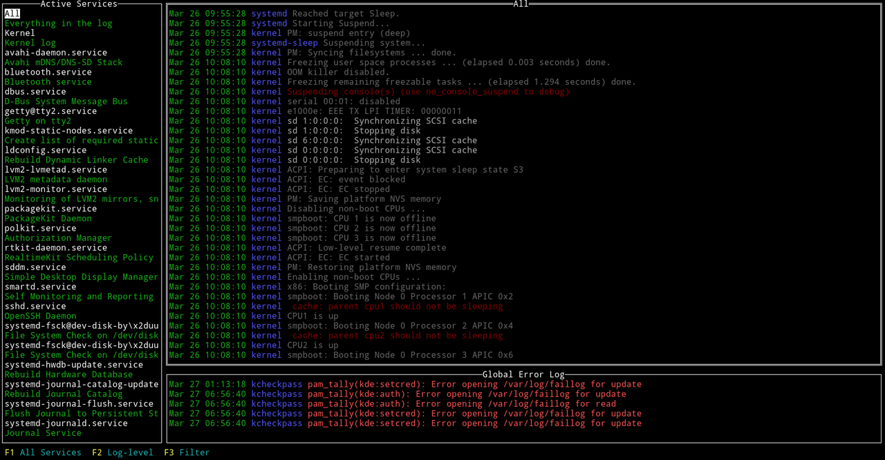

# service-tools

A growing collection of convenient little tools to work with systemd services

## Installation

The `service-tools` require Go 1.11 or higher. Make sure you have a working Go
environment. See the [install instructions](http://golang.org/doc/install.html).

### From source

    git clone https://github.com/muesli/service-tools.git
    cd service-tools/service-generator
    go build
    cd ../service-monitor
    go build

## Overview

### service-generator

A tool to generate systemd Unit files (newthing.service)

To generate a new service file non-interactively simply call:

```
$ service-generator create /path/to/executable "Some description"
```

If you prefer a terminal UI, you can launch it with just an executable or no
arguments at all:

```
$ service-generator create
```

### service-monitor

A monitor for systemd Units

```
$ service-monitor logs
```



```
$ service-monitor services
```


See `--help` for all commands and options.
