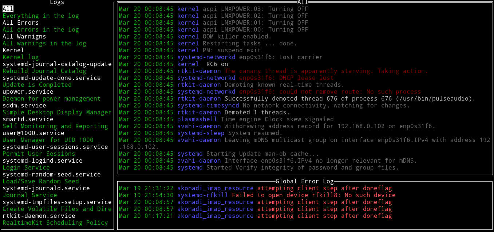

# service-tools

A growing collection of convenient little tools to work with systemd services

## Overview

### service-generator

A tool to generate systemd Unit files (newthing.service)

To generate a new service file non-interactively simply call:

```
$ service-generator create /path/to/executable "Some description"
```

If you prefer a terminal UI, you can launch it with just an executable or no
arguments at all:

```
$ service-generator create
```

### service-monitor

A monitor for systemd Units



```
$ service-monitor logs
```

See `--help` for all commands and options.
